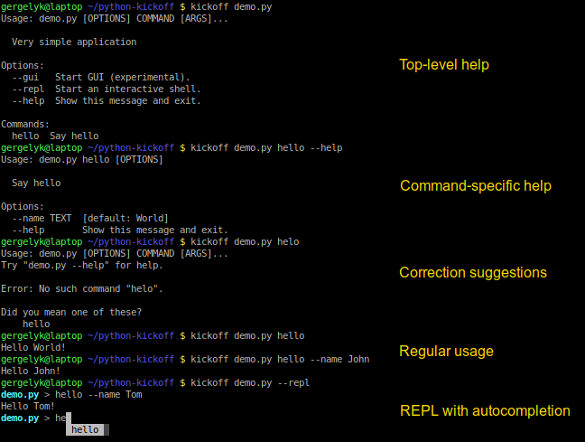
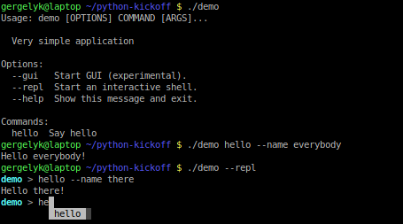
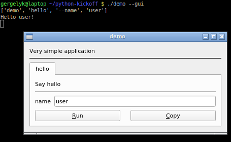

.. kickoff documentation master file, created by
   sphinx-quickstart on Sun Feb 10 15:53:51 2019.
   You can adapt this file completely to your liking, but it should at least
   contain the root `toctree` directive.

Kickoff User's Guide
====================

`Kickoff` turns your Python script or module into an application with decent user interface.

**For software developers...**

`Kickoff` is inspired by utilities like `invoke <http://www.pyinvoke.org>`__, `fire <https://github.com/google/python-fire>`__, `runfile <https://code.activestate.com/pypm/runfile/>`__. It has similar purpose with this difference that it looks at function signatures, therefore doesn't need from the developer to use decorators or any dedicated API. This way `Kickoff` provides developers with following advantages:

* Basic UI provided with zero overhead.
* Enhanced UI provided through annotations.
* Compatibility with environments where `Kickoff` is not installed.
* Testability and reusability of top-level commands.
* Shebang support.

**For software users...**

`Kickoff` is built on top of stunning `click <https://click.palletsprojects.com/>`__ module as well as third-party add-ons to provide the users with following features:

* Hierarchical CLI interface.
* Correction suggestions for misspelled commands.
* REPL with command completion and access to underlying shell.
* GUI (experimental feature).

Quick Start
===========

Let's start from this simple ``demo.py`` script:

.. code:: python

    """Very simple application"""

    def hello(*, name="World"):
        """Say hello"""

        print(f"Hello {name}!")

Assuming that `Kickoff` is :doc:`installed <installation>`, all we really need to do is invoking this script with ``kickoff`` command in place of ``python`` command. `Kickoff` will execute the script and examine top level namespace to collect our functions and then turn them into commands.

----

We can also go one step further and make our script feel like it was an application. For this we need to:

- Prepend code of the script with shebang.
- Optionally removed file extension (.py).
- Add executable attribute.

.. code:: bash

    echo '#!/usr/bin/env kickoff' > demo
    cat demo.py >> demo
    chmod +x demo

Voila! We are ready to check how CLI and REPL work:

There is one more thing to mention. As developers we like to see call stack when unhandled exception is raised. However as regular users we would prefer to see only the error message. Read :ref:`Error Handling` chapter to learn how to handle this aspect.

----

You don't have enough yet? Give GUI a try:

Manual
======

.. toctree::
   :maxdepth: 2

   installation
   basic_concepts
   command_groups
   distributed_design
   settings
   startup
   command_wrapper
   error_handling

Examples
========

- `ex01_simple <https://github.com/gergelyk/python-kickoff/blob/master/examples/ex01_simple/demo.py>`_ Simple example, however covering most of the use cases.

- `ex02_args_and_opts <https://github.com/gergelyk/python-kickoff/blob/master/examples/ex02_args_and_opts/demo.py>`_ Comparison of different arguments and options.

- `ex03_command_groups <https://github.com/gergelyk/python-kickoff/blob/master/examples/ex03_command_groups/demo.py>`_ How to build a nested structure of commands and sub-commands.

- `ex04_distributed_design <https://github.com/gergelyk/python-kickoff/tree/master/examples/ex04_distributed_design>`_ Splitting desing across multiple files.

- `ex05_customization <https://github.com/gergelyk/python-kickoff/blob/master/examples/ex05_customization/demo.py>`_ Way to fine-tune `--help`, `--version` options and other things.

- `ex06_command_wrapper <https://github.com/gergelyk/python-kickoff/blob/master/examples/ex06_command_wrapper/demo.py>`_ Way to wrap each of your commands and handle returned value.

- `ex07_error_handling <https://github.com/gergelyk/python-kickoff/blob/master/examples/ex07_error_handling/demo.py>`_ How not to frighten your users with a traceback each time when something goes wrong.

